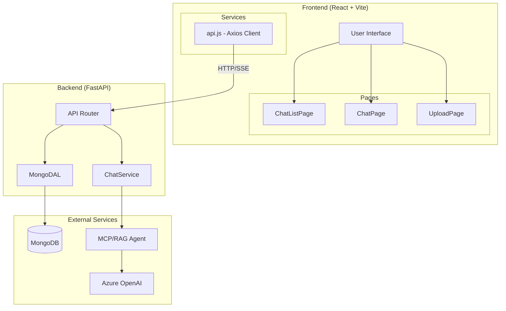

# OpenAI SDK Resume Assistant

An AI-powered resume assistant built with FastAPI, React, and Azure OpenAI with RAG capabilities.

## 🏗️ Architecture



> 📖 See [Full Architecture Diagram](./docs/ARCHITECTURE.mmd) for detailed view

---

## 📚 Documentation

| Document | Description |
|----------|-------------|
| [Architecture](./docs/ARCHITECTURE.mmd) | System overview diagram |
| [Request Flows](./docs/REQUEST_FLOW.mmd) | All request flow diagrams |

### Route-Specific Flows

| Flow | Description |
|------|-------------|
| [App Startup](./docs/routes/request_flow_startup.mmd) | Lifespan & MongoDB connection |
| [Chat List](./docs/routes/chat_list_flow.mmd) | GET /api/chat/all_chats |
| [Create Chat](./docs/routes/create_chat_memory.mmd) | POST /api/chat/create_chat_memory |
| [Chat Stream](./docs/routes/chat_stream_flow.mmd) | POST /api/chat/ask_stream (SSE) |
| [File Upload](./docs/routes/upload_file_flow.mmd) | POST /api/chat/upload_files |

---

## 🚀 Quick Start

### Prerequisites

- Python 3.12+
- Node.js 18+
- MongoDB (local or Railway)
- Azure OpenAI API access

### Backend Setup

```bash
# Install dependencies
uv sync

# Set environment variables
cp .env.example .env
# Edit .env with your credentials

# Run backend
uv run uvicorn openai_sdk_resume_assistant.backend.app.main:app --reload
```

### Frontend Setup

```bash
cd src/openai_sdk_resume_assistant/react-frontend

# Install dependencies
npm install

# Set environment variables
echo "VITE_API_URL=http://localhost:8000" > .env.local

# Run frontend
npm run dev
```

---

## 🔧 Tech Stack

| Layer | Technology |
|-------|------------|
| Frontend | React, Vite, Axios |
| Backend | FastAPI, Motor (async MongoDB) |
| Database | MongoDB |
| AI | Azure OpenAI, MCP Servers |
| Vector Store | ChromaDB |
| Deployment | Railway (backend), Vercel (frontend) |

---

## 📁 Project Structure

```
openai_sdk_resume_assistant/
├── src/
│   └── openai_sdk_resume_assistant/
│       ├── backend/
│       │   └── app/
│       │       ├── api/          # FastAPI routers
│       │       ├── models/       # Pydantic schemas
│       │       ├── services/     # Business logic
│       │       └── main.py       # App entry point
│       ├── react-frontend/
│       │   └── src/
│       │       ├── components/   # React components
│       │       ├── hooks/        # Custom hooks
│       │       ├── pages/        # Page components
│       │       └── services/     # API client
│       ├── RAG/                  # Vector DB & RAG agent
│       └── mcp_servers/          # MCP server implementations
├── docs/                         # Architecture diagrams
└── Dockerfile                    # Container config
```

---

## 🎨 Component Design

### Keep Separate ✅

Components follow good React practices:

| Principle | Implementation |
|-----------|----------------|
| **Single Responsibility** | `ChatBubble` → Renders one message |
| | `ChatMessages` → Manages message list + auto-scroll |
| | `ChatInput` → Handles user input |
| | `ChatWindow` → Orchestrates everything |
| **Easier Testing** | Test components in isolation |
| **Reusability** | `ChatBubble` can be used elsewhere |
| **Future-Proofing** | Add markdown to `ChatBubble`? Just edit one file |

---

## 🌐 API Endpoints

### Chat Endpoints

| Method | Endpoint | Description |
|--------|----------|-------------|
| GET | `/api/chat/all_chats` | List all chats |
| POST | `/api/chat/create_chat_memory` | Create new chat |
| GET | `/api/chat/chat_memory/{id}` | Get chat by ID |
| DELETE | `/api/chat/delete_chat/{id}` | Delete chat |
| POST | `/api/chat/ask_stream` | Stream AI response |
| POST | `/api/chat/upload_files` | Upload documents |

### VectorStore Endpoints

| Method | Endpoint | Description |
|--------|----------|-------------|
| GET | `/api/chat/vectorstore/collections` | List collections |
| GET | `/api/chat/vectorstore/stats` | Get collection stats |
| DELETE | `/api/chat/vectorstore/clear` | Clear collection |
| POST | `/api/chat/vectorstore/reset` | Reset vectorstore |

---

## 🔐 Environment Variables

### Backend (Railway)

```env
AZURE_OPENAI_API_KEY=your-key
AZURE_OPENAI_ENDPOINT=https://your-resource.openai.azure.com/
MONGODB_URI=mongodb://...
DATABASE_NAME=resume_db
SECRET_KEY=your-jwt-secret
```

### Frontend (Vercel)

```env
VITE_API_URL=https://your-backend.up.railway.app
```

---

## 📄 License

MIT

---

## 🤝 Contributing

1. Fork the repository
2. Create a feature branch
3. Make your changes
4. Submit a pull request

## Others
### Your components follow good React practices:

    Single Responsibility Principle

    ChatBubble → Renders one message
    ChatMessages → Manages message list + auto-scroll
    ChatInput → Handles user input
    ChatWindow → Orchestrates everything
    Easier Testing

    Can test ChatBubble rendering independently
    Can test ChatInput key handling in isolation
    Mocking is simpler
    Better Reusability

    You might reuse ChatBubble elsewhere (notifications, preview, etc.)
    ChatInput could be used in other forms
    Clearer Mental Model

    Easy to find which file to edit
    New developers understand structure faster
    Future-Proofing

    Adding markdown rendering to ChatBubble? Just edit one file
    Need to add file attachments to ChatInput? Isolated change
    Want typing indicators in ChatMessages? Clear location

